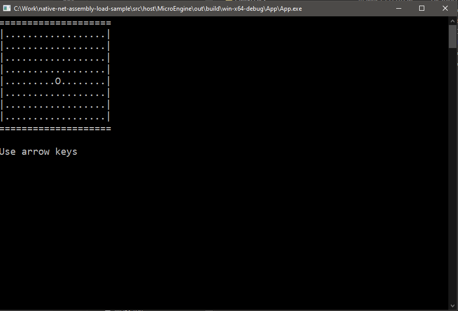

# MicroEngine

**MicroEngine** is a lightweight, console-based game engine demo written in C++ and C#. Its primary purpose is to demonstrate embedding a .NET runtime in a native application using `hostfxr`, enabling .NET-based scripting or plugin systems for native engines or apps.

This project is ideal for developers who want:
- To embed .NET into a native C++ application
- A working reference for plugin architectures (cross-platform or desktop apps)
- An educational tool for C++/.NET interop and `hostfxr` integration
- A minimal Unity-like engine example with GameObject and Component patterns

The actual "game" is just a stage where you can move your player around using the arrow keys. _Absolutely riveting gameplay_.

---

## 🧱 Project Structure
```
/src
├── host/
│ └── MicroEngine/
│   ├── App/ # C++ shim app that loads the Engine DLL
│   └── Engine/ # C++ Engine code and .NET interop logic
├── sdk/ # C# interop library used by game scripts
├── game/ # C# user game code
└── MicroEngine.sln # Contains SDK and Game projects for convenience
```

### Native Code

- **App**: A minimal host application that loads the Engine and starts the game.
- **Engine**: A native DLL that performs all engine logic, including loading and initializing the .NET runtime and handling interop.

### Managed Code

- **MicroEngineSDK**: C# SDK that exposes interop bindings to the engine and loads the user’s game assembly.
- **Game**: A sample C# game where the player moves around in a square room using arrow keys.

## ⚙️ Requirements

- [.NET SDK 9.0+](https://dotnet.microsoft.com/)
- C++20 compiler (tested with MSVC)
- [CMake 3.8+](https://cmake.org/download/)
- Visual Studio (optional, for easier building and debugging)

## 🚧 Build

### Via Build Script
Run `build.ps1` through powershell. (on non-Windows devices you can get the lates PowerShell from [here](https://learn.microsoft.com/en-us/powershell/scripting/install/installing-powershell?view=powershell-7.5))

That's it. 

>Note: The default build profile for the script is `win-x64-release`

### Via Visual Studio

#### Build Native Projects
Open the `/src/host/MicroEngine/` folder in Visual Studio (you must have CMake tooling installed). Rebuild the projects.

#### Building Managed Projects
Open `/scr/MicroEngine.sln` and build. If you're building in debug, you can actually start debugging the `Game` project (if it's set as the startup project). The profile is setup to launch the app executable from `win-x64-debug`. Note that you must first have build the native binaries for this to work, you will get an error otherwise.

## 🚀 Run the Demo
You will find the binaries in the following path:
`/src/host/MicroEngine/out/build/<profile>/App/`
`App.exe` is the target to run.

This will:
- Load `MicroEngineSDK.dll` using `hostfxr`
- Load and reflect over Game.dll
- Execute the game loop in the console

## 🔄 Interop Architecture

### Native → .NET

- Uses `hostfxr` to bootstrap the .NET runtime and retrieve a delegate via `hostfxr_get_runtime_delegate`.
- Invokes `[UnmanagedCallersOnly]` methods in .NET, such as:
```csharp
  EngineAPI.Initialize(IntPtr enginePtr, int size)
```

### .NET → Native

- The engine exposes a **C-style API**.
- This is accessed in C# via `[DllImport]` bindings.
- Interaction with native objects is done through raw `IntPtr`s returned by native functions.
- The C# side wraps these in classes like `NativeObjectWrapper`.

### Assembly Loading

- The SDK is loaded by the native engine via `hostfxr`.
- From there, the SDK loads the user game assembly (`Game.dll`) using:
```csharp
  var asm = Assembly.Load("Game");
```
- It uses reflection to discover all `Component`-derived types and the class that implements `IGameEntry`.
- The game code is invoked through this interface.

> ℹ️ The default `AssemblyLoadContext` (ALC) is used — no manual ALC handling is implemented.

## 🧪 Debugging Support

- Simply attach **Visual Studio** to the running `App.exe`.
- Works with **mixed-mode debugging** — you can set breakpoints in both C++ and C# code.
- PDBs are respected, allowing full step-through across native and managed boundaries.
- Other debuggers that support native + managed interop may work similarly.

## ⚠️ Limitations & Warnings

- ❗ This is a **demo** — no robust error handling is implemented.
  - `assert` is used liberally; you must add error checking in production.
- ❗ Interop is **not secure**:
  - The C# side is given raw `IntPtr`s to native engine objects.
  - A malicious actor could manipulate memory with unsafe code.
  - In real-world code, use opaque handles or strongly-typed interop wrappers.
- ❗ Only tested on **Windows**, but the design is cross-platform friendly.
- The app is **single-threaded by design**, to avoid overcomplicating the sample.
- All config is **hardcoded** — no external JSON/runtime configs.

## 🧩 Engine Design Notes

- Loosely inspired by **Unity’s architecture**:
  - `GameObject` and `Component`-based design
  - Components added with `.AddComponent<T>()`
- The native engine invokes `Tick()` in the SDK that will ultimately invoke `Start()` and `Update()` on C# `Component` instances via interop.
- All game behavior is implemented in C# components.
- The native side just drives the main loop and manages state and interop.

> A more detailed explanation of the engine will be provided in `docs/ENGINE.md`. If you can't find that file in repo that means I was lazy and didn't write it yet.

## 📦 Binary Layout

> Note: I'll assume you are using Windows to build this in `Release` configuration

To run the demo correctly ensure the following structure in the `src/host/MicroEngine/out/build/` directory:
- `net9.0` - this folder should contain: `.runtimeconfig.json`, `MicroEngineSDK.dll` and `Game.dll`
- `win-x64-release/App` - this folder should contain the main executable `App.exe` and `Engine.dll`

What are these files:
- `.runtimeconfig.json` - a configuration used by the loader to... load the sdk dll
- `App.exe` - main executable
- `Engine.dll` - the engine core
- `MicroEngineSDK.dll` - the C# SDK
- `Game.dll` - the user game code

> Note: If you build this via a build script, Visual Studio or manually, they should all be in the correct locations.

## Q&A

### What is `hostfxr`?

This library finds and resolves the runtime and all the frameworks the app needs. Then it loads the hostpolicy library and transfers control to it.

The host FXR library reads the .runtimeconfig.json of the app (and all it's dependent frameworks) and resolves the frameworks. It implements the algorithm for framework resolution as described in SharedFX Lookup and in Framework version resolution.

In most cases the latest available version of hostfxr is used. Self-contained apps use hostfxr from the app folder.

The main reason to split the entry-point host and the hostfxr is to allow for servicing the logic in hostfxr without the need to stop all instances of the executable host currently running. In the case of apphost and all the library hosts, servicing the entry-point host is impossible as they are part of the application itself.

> Note: Extracted from the docs found [here](https://github.com/dotnet/runtime/blob/main/docs/design/features/host-components.md)

### This looks AI generated

Yes. This README file is. The code is not (well, maybe just the linux code in the engine a little). I was lazy and put a ton of info about this project into ChatGPT and told it to spit out most of this then modified it myself. I've actually checked what's here.

### I can't load the Game assembly... file not found?

If your folder `out/build/.net9.0` contains Game.deps.json, delete it.